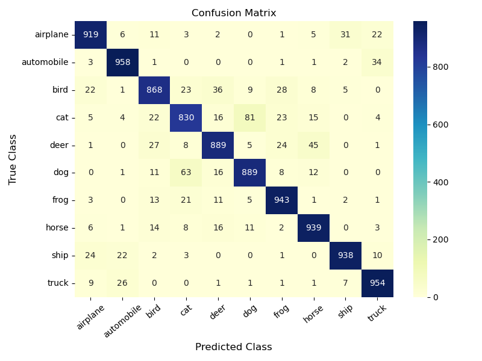
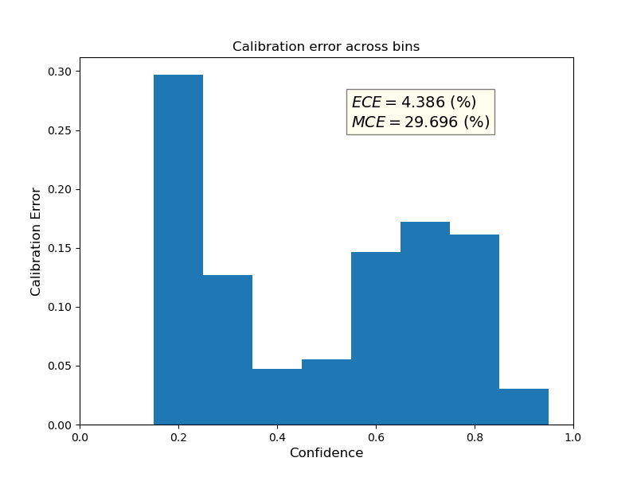

# A Script to Assess the Performance of a Classification Model

[License ](https://github.com/vantainguyen/CodeExamAthenaAI/blob/main/LICENSE)
<br clear="left">
## This script executes the following 5 steps to assess the performance of the model:

**Step 1**
<br clear="left">
Perform inference on a testing dataset.
<br clear="left">
**Step 2**
<br clear="left">
Create and plot a Confusion matrix.
Example:
<br clear="left">

<br clear="left">
**Step 3**
<br clear="left">
Compute and plot Calibration error.
Example:
<br clear="left">

<br clear="left">
**Step 4**
<br clear="left">
Save false positives from each class.
<br clear="left">
**Step 5**
<br clear="left">
Find potential patterns in the false positives.
<br clear="left">
## Usage instructions

- For Cifar10 dataset, download and extract the test dataset and the weights of the ConvNext model into the working directory (For the ConvNext models pretrained on Cifar10 dataset, their weights can be downloaded from https://osf.io/download/5g2ds; the Cifar10 test dataset can be downloaded from https://osf.io/download/zg9s5). It's noted that the testing images need to be contained in a sub-folder manner; in the other words, images of each class are contained in each sub-folder. 

**In linux**
```bash
To download pre-trained weights:
$ wget https://osf.io/download/5g2ds
$ unzip 5g2ds
and to download Cifar10 test dataset:
$ wget https://osf.io/download/zg9s5
$ unzip zg9s5
```

- Create new environment and install dependencies using Conda

```bash
conda env create -f environment.yml
conda activate CodeExam3.7.15
```

- Execution of the script

```bash
python test.py data --model
```
data: A path to folder containing test dataset; model: Name of model to use, default is 'tiny' but can be 'small', 'large' and 'base'.
   <br clear="left">
## Limitations
- This script has two following limitations:
    <br clear="left">
1. The confusion matrix has not been saved.
    <br clear="left">
    Solution: Adding plt.savefig(path_to_save) to the plot_confusion_matrix function from utils.py to save the plot in path_to_save.
    <br clear="left">
2. It is required to perform the inference twice which increases the execution time.
    <br clear="left">
    Solution: Merge step 4 with step 1 to perform the inference and save the false positives of each class at once.
    <br clear="left">
